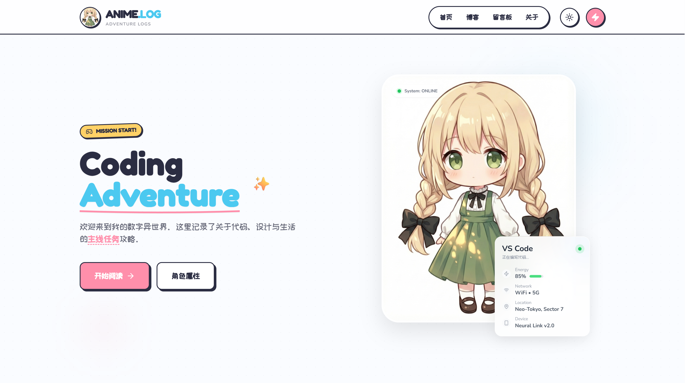

# 🌌 Suxinnai's Digital World



> “喜欢把日常写成微光，把思绪折成风。”

欢迎来到 **Suxinnai** 的个人博客源码仓库！这是一个基于 **Astro** 构建的、充满 **RPG 游戏元素** 与 **赛博朋克** 风格的数字空间。

这里不仅是记录代码与生活的地方，更是一个连接物理世界与数字世界的实验场。

## ✨ 特性 (Features)

*   **🎮 RPG 沉浸式体验**：
    *   **角色状态面板 (Status)**：首页与关于页的 RPG 风格仪表盘，展示等级、属性雷达图、HP/MP 条。
    *   **任务系统 (Quest)**：以“当前任务”展示正在进行的项目进度。
    *   **装备栏 (Inventory)**：酷炫的网格展示常用设备（包含那只卡皮巴拉！）。
*   **🔌 数字孪生 (Digital Twin)**：
    *   **实时同步**：集成 Vercel KV + MacroDroid，将现实世界手机的电量、网络、位置实时映射到网页上。
    *   **动态交互**：React 组件驱动，支持实时轮询更新。
*   **🎨 极致 UI/UX**：
    *   **暗黑模式 (Dark Mode)**：全站完美适配深色主题，深夜阅读护眼又酷炫。
    *   **流畅动画**：微交互、粒子效果、以及丝滑的页面过渡。
*   **📝 内容管理**：
    *   **MDX 支持**：使用 Markdown 撰写文章，支持嵌入自定义组件。
    *   **自动目录**：文章详情页自动生成“任务简报”风格的目录 (TOC)。
    *   **阅读时长**：自动估算文章阅读时间。
*   **💬 交互系统**：
    *   **留言板 (Guestbook)**：冒险者酒馆风格的留言墙，集成 Giscus (GitHub Discussions)。

## 🛠️ 技术栈 (Tech Stack)

*   **框架**: [Astro 5.0](https://astro.build/)
*   **UI 库**: React (用于动态组件)
*   **样式**: [Tailwind CSS](https://tailwindcss.com/)
*   **图标**: Lucide React
*   **数据库**: Vercel KV (Redis)
*   **部署**: Vercel

## 🚀 快速开始 (Quick Start)

### 1. 克隆项目
```bash
git clone https://github.com/Suxinnai/my-astro-blog.git
cd my-astro-blog
```

### 2. 安装依赖
```bash
npm install
```

### 3. 本地运行
```bash
npm run dev
```
访问 `http://localhost:4321` 即可开启冒险！

## ⚙️ 配置指南 (Configuration)

### 数字孪生 (Digital Twin)
要让首页的“胶囊”显示真实数据：
1.  在 Vercel 项目中创建一个 **KV Database**。
2.  获取 `KV_REST_API_URL` 和 `KV_REST_API_TOKEN` 环境变量。
3.  在 Android 手机上下载 **MacroDroid**，配置 POST 请求发送到 `/api/status/update`。
4.  *详细教程请阅读博客文章：《不仅是好看：揭秘“手机状态同步”配置》*

### 留言板 (Guestbook)
1.  修改 `src/pages/guestbook.astro` 中的 Giscus 配置。
2.  将 `data-repo` 替换为你自己的 GitHub 仓库。

## 🤝 贡献 (Contributing)

如果你有任何有趣的想法，欢迎提交 Issue 或 Pull Request！让我们一起把这个异世界建设得更完美。

## 📄 License

MIT © [Suxinnai](https://github.com/Suxinnai)
